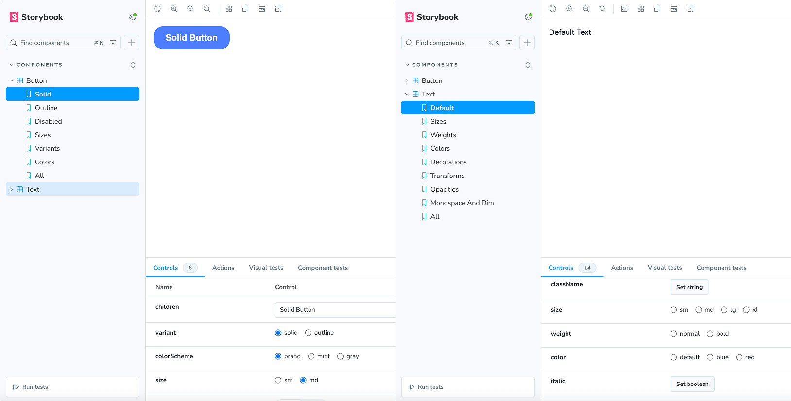

# dash-ui-react

**dash-ui-react** is a UI component library for React with TypeScript, TailwindCSS, and class-variance-authority (CVA) support.

The project is intended for use in the dash platform and is connected as a modular external dependency.

Components are bundled with Rollup while preserving the modular structure. Types are generated separately using `tsc`.

This ui-kit is in a very early stage of development, and currently supports only ThemeContext and two components:

Soon you will be able to see them in the storybook online .
Now you can clone this repository and run storybook locally with
```bash
npm run storybook
```

## Features

- ✅ ESM and CJS export support
- 🎨 Styling with TailwindCSS and CVA
- 📦 Export via submodules: `dash-ui/button`, `dash-ui/input`, etc.
- 🧱 Built with Rollup
- 📄 Generation of `.d.ts` type definitions
- 📚 Storybook for documentation

## Installation

```bash
npm install ./dash-ui-0.1.0.tgz
```

## Usage

```tsx
import { ThemeProvider, useTheme, Button, Text } from 'dash-ui/react';
```

## Build

```bash
npm run build-kit
```

## Storybook

```bash
npm run storybook
```

## License

MIT
